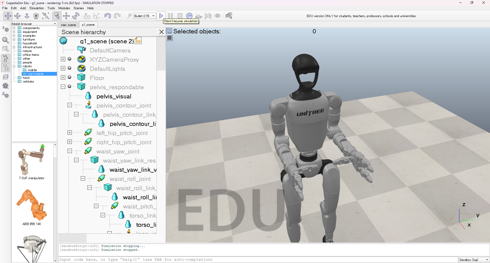

# Unitree-G1-Dex3 WebXR Teleoperation Operation Manual

## Quick Start
- [Step 1: Run HTTPS Server](#step-1-run-https-server)
- [Step 2: Build MQTT Broker](#step-2-build-mqtt-broker)
- [Step 3: Simulator Setup](#simulator-setup)
- [Step 4: Operate the Robot in Simulator](#run-the-robot-in-simulator)

---
## Step 1: Run HTTPS Server

💡 **If this is your first time running the project, install the required Node.js modules:**
```bash
npm install
```

**The project is designed to run in VS Code. Download it here:**  
[https://code.visualstudio.com/](https://code.visualstudio.com/Download)

**If you do not have Node.js installed, download it here:**  
[https://nodejs.org/en/download](https://nodejs.org/en/download)

**On Windows, you may need to allow script execution before running the server:**
```powershell
Set-ExecutionPolicy -Scope CurrentUser -ExecutionPolicy RemoteSigned
```

🚀 **To start the Next.js HTTPS server, run:**
```bash
npm run dev-https
```

After starting, you will see two URLs:
- Local:   [https://localhost:3000](https://localhost:3000)
- Network: https://192.168.197.**:****

⚠️ **The Network IP address may vary** depending on your network environment.

⚠️ **In VR, only HTTPS can enter VR/AR mode.**

**Open the browser in your VR device and enter `https://192.168.197.**:****` to access the web interface.**

---
## Step 2: Build MQTT Broker
Follow the repository: [https://github.com/vettayruu/Metawork_MQTT_Protocol]

---
## Step 3: Simulator Setup

[CoppeliaSim](https://www.coppeliarobotics.com/) is used in this project.

1. **Download CoppeliaSim**

   Visit the official website to download the latest version: [https://www.coppeliarobotics.com/](https://www.coppeliarobotics.com/)

2. **Launch CoppeliaSim**

   - **On Ubuntu:** Navigate to your CoppeliaSim installation directory and run:
     ```bash
     ./coppeliaSim
     ```
   - **On Windows:** Run the application directly by double-clicking the executable.

3. **Load the simulation scene**

   In folder `Robot_Control/Sim` find the file `g1_scene.zip` and unzip it.
   In CoppeliaSim, `File/Open scene...` to load this scene file.

5. **Start the simulation**

   Click the "Play" button in CoppeliaSim to start the simulation.

<div align="center">
  
  <p><em>Figure: G1 Simulation in Coppeliasim.</em></p>
</div>

---
## Step 4: Operate the Robot in Simulator

### 1. Run the MQTT Client
In folder `Robot_Control/MQTT`, run
```Python
MQTT_Client.py
```

Then, in folder `Robot_Control`, run
```Python
MQTT_Simulation_Left.py
MQTT_Simulation_Right.py
```

### 2. Request Robot
On the webpage, click `Request Robot` to build communication with the robot.
If robot request successfully, the `Robot ID` will show the connected robot ID.

<div align="center">
  
  <p><em>Figure: Request Robot.</em></p>
</div>

### 3. Operation
The operation is based on hand tracking. Gestures are desgined for robot control.

<div align="center">
  
  <p><em>Figure: Gesture show menu.</em></p>
</div>

<div align="center">
  
  <p><em>Figure: Gesture trigger off.</em></p>
</div>

<div align="center">
  
  <p><em>Figure: Gesture trigger on.</em></p>
</div>

<div align="center">
  
  <p><em>Figure: Gesture grip (thumb and index).</em></p>
</div>

<div align="center">
  
  <p><em>Figure: Gesture grip (middle).</em></p>
</div>


