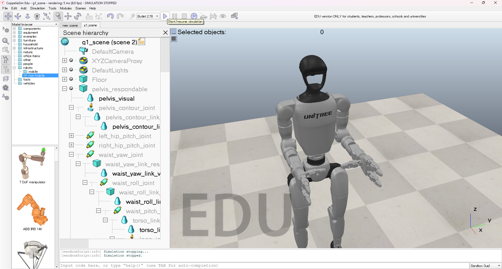
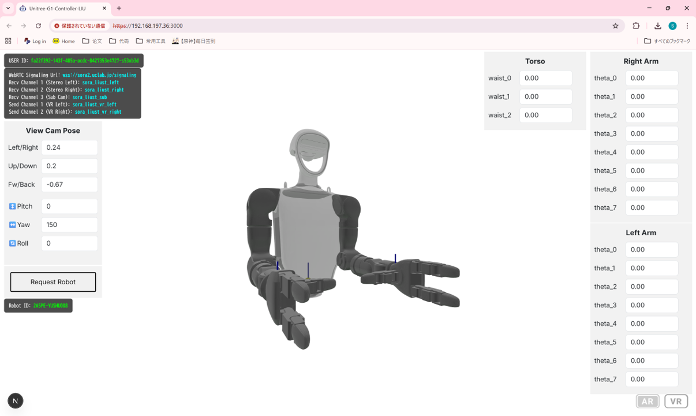
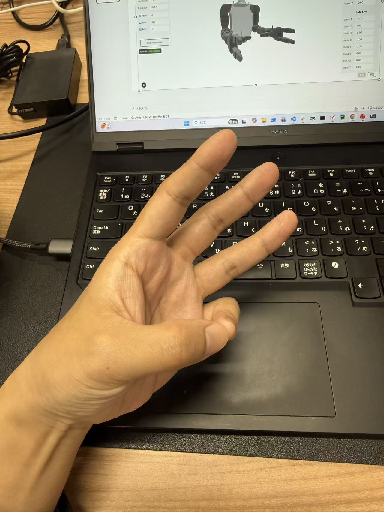
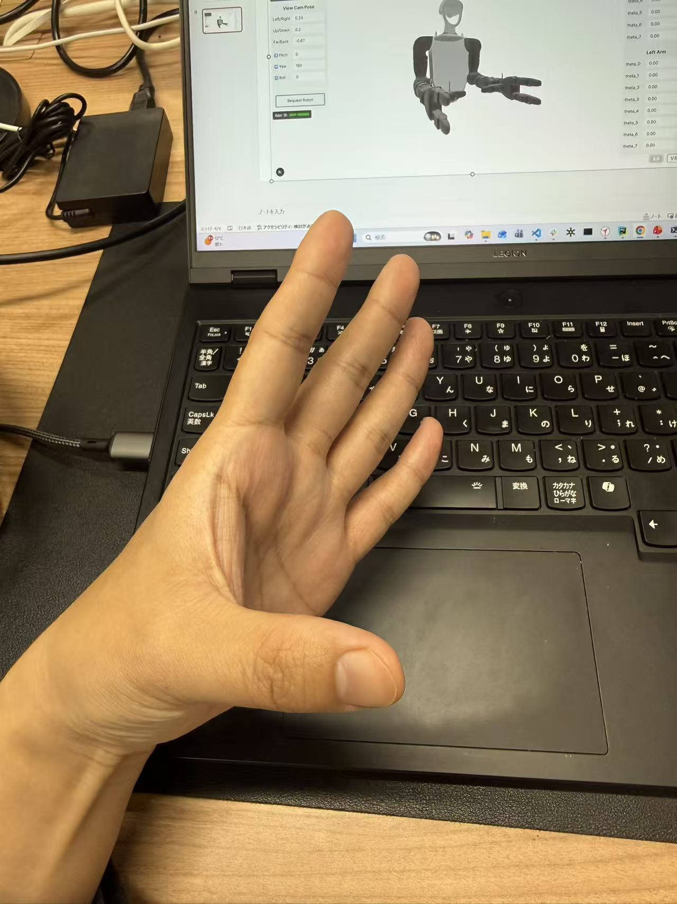
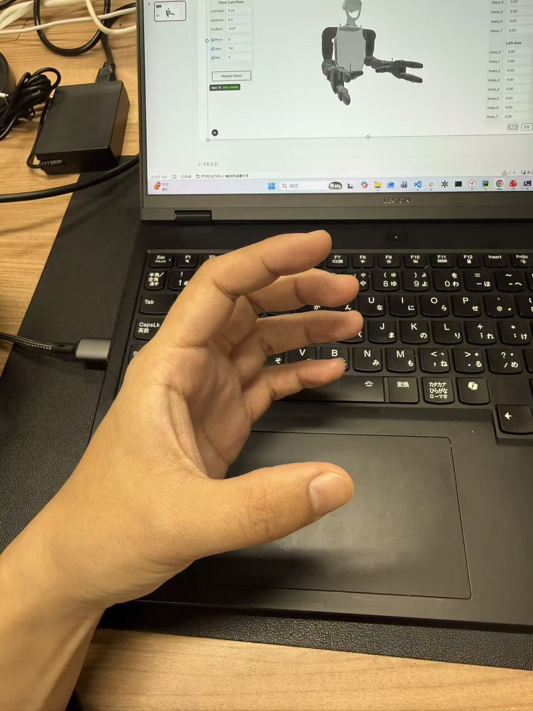
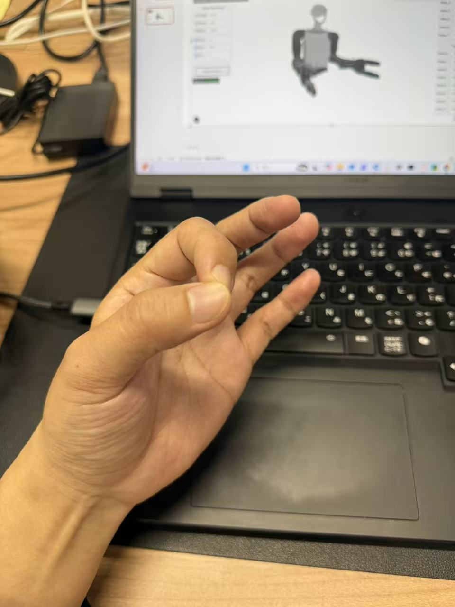
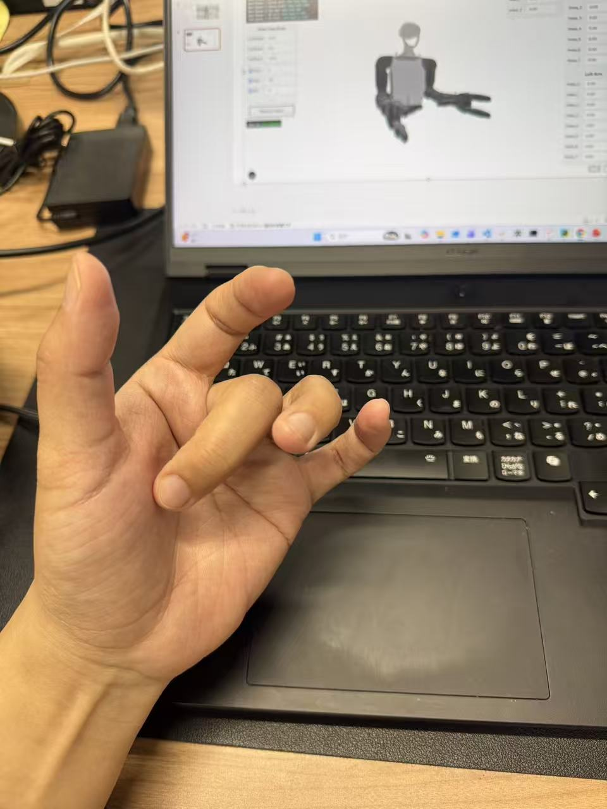

# Unitree-G1-Dex3 WebXR Teleoperation Operation Manual

## Quick Start
- [Step 1: Install and Run HTTPS Server](#step-1-install-and-run-https-server)
- [Step 2: Build MQTT Broker](#step-2-build-mqtt-broker)
- [Step 3: Simulator Setup](#step-3-simulator-setup)
- [Step 4: Operate the Robot in Simulator](#step-4-operate-the-robot-in-simulator)

---
## Step 1: Install and Run HTTPS Server

💡 **If this is your first time running the project, install the required Node.js modules:**
```bash
npm install
```

**The project is designed to run in VS Code. Download it here:**  
[https://code.visualstudio.com/](https://code.visualstudio.com/Download)

**If you do not have Node.js installed, download it here:**  
[https://nodejs.org/en/download](https://nodejs.org/en/download)

**On Windows, you may need to allow script execution before running the server:**
```powershell
Set-ExecutionPolicy -Scope CurrentUser -ExecutionPolicy RemoteSigned
```

🚀 **To start the Next.js HTTPS server, run:**
```bash
npm run dev-https
```

After starting, you will see two URLs:
- Local:   [https://localhost:3000](https://localhost:3000)
- Network: https://192.168.197.**:****

⚠️ **The Network IP address may vary** depending on your network environment.

⚠️ **In VR, only HTTPS can enter VR/AR mode.**

**Open the browser in your VR device and enter `https://192.168.197.**:****` to access the web interface.**

---
## Step 2: Robot Communication Network Setup

This repository requires **Mosquitto** and **nginx** for robot communication.
Mosquitto acts as an MQTT broker, and nginx proxies HTTP traffic to HTTPS for the VR client, which only accepts secure HTTPS connections.

The `Robot_Control/MQTT` folder contains example configuration files for both Windows and Ubuntu.

---

### Installation on Windows
For Windows, download the required software:
- [Mosquitto](https://mosquitto.org/download/)
- [Nginx](https://nginx.org/en/download.html)


### Mosquitto Setup

Open the configuration file `mosquitto.conf` in the installation folder and add the following:

```bash
listener 1883
listener 9001
protocol websockets
allow_anonymous true
```

> Port `1883` is used for standard MQTT (TCP) and port `9001` for MQTT over WebSockets.
> The port numbers can be changed as needed.


### SSL Certificate

nginx requires an SSL certificate to serve HTTPS.
The following steps generate a **self-signed certificate** for local development use.

Run `generate-ssl-cert.js` to generate self-signed certificate.

> **Note:** Browsers will show a security warning for self-signed certificates.
> You will need to manually accept the certificate the first time you visit the site.


### Nginx Setup

Open the configuration file at `conf/nginx.conf` and replace its contents with `nginx.conf`.


### Nginx Commands on Windows

| Action | Command |
|---|---|
| Start nginx | `start nginx` |
| Stop nginx | `taskkill /f /im nginx.exe` |

Every time changing the config file, nginx should be restarted.


### Verify the Setup

1. Open `https://localhost` or `https://liust.local` — you should see the **nginx welcome page**.
2. Open `https://localhost/mqtt` — you should see **502 Bad Gateway**, which is expected when Mosquitto is not yet running.

> Since this uses a self-signed certificate, your browser will show a warning on first visit.
> Click **Advanced → Proceed** to accept it.

---
### Installation on Ubuntu

Install Mosquitto and nginx using `apt`:

```bash
sudo apt update
sudo apt install -y mosquitto mosquitto-clients nginx
```

Confirm both services are running:

```bash
sudo systemctl status mosquitto
sudo systemctl status nginx
```

---

### Mosquitto Setup

Open the configuration file:

```bash
sudo nano /etc/mosquitto/mosquitto.conf
```

Add the following lines:

```
listener 1883
listener 9001
protocol websockets
allow_anonymous true
```

Restart Mosquitto to apply the changes:

```bash
sudo systemctl restart mosquitto
```

> Port `1883` is used for standard MQTT (TCP) and port `9001` for MQTT over WebSockets.
> The port numbers can be changed as needed.

---

### SSL Certificate

Run the following command to generate a self-signed certificate:

```bash
sudo openssl req -x509 -nodes -days 365 -newkey rsa:2048 \
  -keyout /etc/ssl/key.pem \
  -out /etc/ssl/cert.pem \
  -subj "/CN=localhost" \
  -addext "subjectAltName=IP:127.0.0.1,DNS:localhost,DNS:liust.local"
```

| File | Description |
|---|---|
| `/etc/ssl/cert.pem` | Public certificate sent to clients |
| `/etc/ssl/key.pem` | Private key — keep this secure |

> **Note:** Browsers will show a security warning for self-signed certificates.
> You will need to manually accept the certificate the first time you visit the site.

---

### nginx Setup

Open the configuration file:

```bash
sudo nano /etc/nginx/nginx.conf
```

Replace its contents with the nginx.conf.
Don't forget to change the server name and the path of SSL.

---

### nginx Commands

| Action | Command |
|---|---|
| Validate config | `sudo nginx -t` |
| Start nginx | `sudo systemctl start nginx` |
| Reload after changes | `sudo systemctl reload nginx` |

---

### Verify the Setup

1. Open `https://localhost` or `https://liust.local` — you should see the **nginx welcome page**.
2. Open `https://localhost/mqtt` — you should see **502 Bad Gateway**, which is expected when Mosquitto is not yet running.

> Since this uses a self-signed certificate, your browser will show a warning on first visit.
> Click **Advanced → Proceed** to accept it.


---
## Step 3: Simulator Setup

[CoppeliaSim](https://www.coppeliarobotics.com/) is used in this project.

1. **Download CoppeliaSim**

   Visit the official website to download the latest version: [https://www.coppeliarobotics.com/](https://www.coppeliarobotics.com/)

2. **Launch CoppeliaSim**

   - **On Ubuntu:** Navigate to your CoppeliaSim installation directory and run:
     ```bash
     ./coppeliaSim
     ```
   - **On Windows:** Run the application directly by double-clicking the executable.

3. **Load the simulation scene**

   In folder `Robot_Control/Sim` find the file `g1_scene.zip` and unzip it.
   In CoppeliaSim, `File/Open scene...` to load this scene file.

5. **Start the simulation**

   Click the "Play" button in CoppeliaSim to start the simulation.

<div align="center">
  
  <p><em>Figure: G1 Simulation in Coppeliasim.</em></p>
</div>

---
## Step 4: Operate the Robot in Simulator

### 1. Run the MQTT Client
In folder `Robot_Control/MQTT`, run

```Python
python SAP_Device_Data_Manager.py
```

and 
```Python
MQTT_Client_SAP.py
```

Then, in folder `Robot_Control`, run
```Python
MQTT_Simulation_Left.py
MQTT_Simulation_Right.py
```

### 2. Request Robot
On the webpage, click `Request Robot` to build communication with the robot.
If robot request successfully, the `Robot ID` will show the connected robot ID.

<div align="center">
  
  <p><em>Figure: Request Robot.</em></p>
</div>

### 3. Operation
The operation is based on hand tracking. Gestures are desgined for robot control.

<div align="center">
  
  <p><em>Figure: Gesture show menu.</em></p>
</div>

<div align="center">
  
  <p><em>Figure: Gesture trigger off.</em></p>
</div>

<div align="center">
  
  <p><em>Figure: Gesture trigger on.</em></p>
</div>

<div align="center">
  
  <p><em>Figure: Gesture grip (thumb and index).</em></p>
</div>

<!-- <div align="center">
  
  <p><em>Figure: Gesture grip (middle).</em></p>
</div> -->


